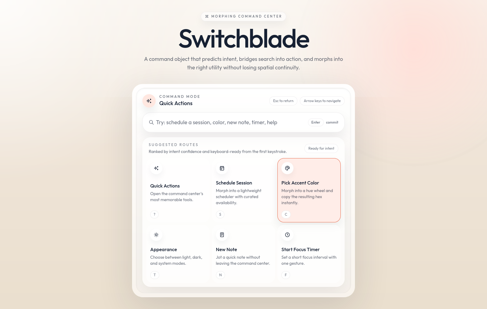

# Switchblade

Switchblade is a high-fidelity morphing command center demo built to showcase senior frontend interaction design, motion systems, and polished state transitions.

In its default state, Switchblade presents a command surface with quick routes. As the user types or selects an intent, the shell predicts the destination and morphs into the right utility instead of opening a disconnected modal or page.



## What It Does

- Provides a command-driven entry point for multiple tools
- Predicts user intent from typed queries
- Morphs a shared shell into focused utility states
- Supports keyboard navigation, escape/back flows, and reduced-motion-aware transitions
- Adapts to both light and dark themes

## Current Utilities

- `Quick Actions` - a launch surface for the most important routes
- `Schedule Session` - a lightweight scheduler with curated availability
- `Pick Accent Color` - a hue-based color tool with copy-ready hex output
- `Appearance` - light, dark, and system theme switching
- `New Note` - a lightweight note composer
- `Start Focus Timer` - a compact focus timer utility
- `Search Results` - a fallback state for lower-confidence or exploratory queries

## Interaction Model

- `Command mode` - the shell starts as a search-first command object
- `Prediction` - typed input is scored against supported intents
- `Bridge` - the shell prepares the destination while preserving continuity
- `Morph` - the command surface expands into the selected utility
- `Return` - `Esc` and back actions reverse the same object back to command mode

## Built With

- `React 19` for the UI architecture
- `TypeScript` for typed state and interaction models
- `Vite` for development and build tooling
- `motion` for layout transitions and shared-shell animation
- `Tailwind CSS v4` for styling and theme-aware utility classes
- `Base UI` and `shadcn/ui` primitives for accessible controls and app structure
- `react-day-picker` for the calendar utility
- `date-fns` for date formatting and scheduling data
- `@tabler/icons-react` for iconography
- `@fontsource-variable/outfit` for typography

## Local Development

```bash
pnpm install
pnpm dev
```

## Available Scripts

```bash
pnpm dev
pnpm build
pnpm typecheck
pnpm lint
pnpm preview
```
